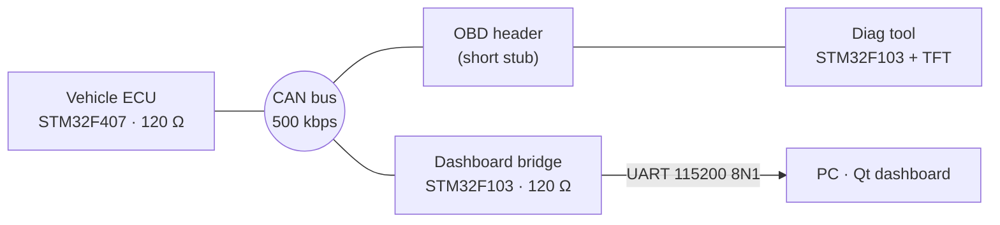

# CANsyn: Vehicle CAN Diagnostic

A small, bare-metal automotive diagnostic system on STM32: a simulated **vehicle ECU** that broadcasts live data and stores DTCs, a handheld **OBD-II style Diag tool** with a TFT, a **CAN-to-UART bridge**, and a **Qt dashboard** on the PC. Everything talks over one **CAN 2.0A, 500 kbps** bus.


> **Status:** firmware v1.0 is written and unit-tested on a PC, but **not yet validated on hardware**. The Qt dashboard is **not implemented yet**. See [Roadmap](#roadmap).

---

## Table of contents

- [Features](#features)
- [System architecture](#system-architecture)
- [Repository layout](#repository-layout)
- [Hardware](#hardware)
- [CAN and OBD protocol](#can-and-obd-protocol)
- [Getting started](#getting-started)
- [Testing](#testing)
- [Design notes](#design-notes)
- [Roadmap](#roadmap)
- [Documentation](#documentation)
- [License](#license)
- [Author](#author)

---

## Features

**Vehicle ECU (STM32F407)**
- Simulated speed and rpm from a 95 s drive cycle, coolant temperature and battery voltage from ADC, wheel-speed sensor from a push button.
- Periodic frames: `0x100` VEHICLE_STATE every 20 ms, `0x101` VEHICLE_STATUS every 100 ms.
- Four DTCs (P0217, P0118, P0562, C0035) with an `IDLE → PENDING → CONFIRMED` state machine (2 s confirmation) and a MIL flag.
- OBD-II server: services `01` (PID 05, 0C, 0D), `03`, `07`, `04`, with negative responses (NRC `11`, `31`, `22`).

**Diag tool (STM32F103 + ST7735 TFT)**
- Three buttons (Live / Read / Clear) and four screens: Home, Live data, DTC list, Clear result.
- 100 ms timeout with one retry, "No response" reporting, two-press Clear with automatic verification (`03`) afterwards.
- 1.8" TFT driven over SPI + DMA with **no framebuffer**: only changed text cells are redrawn.
- Every result is also printed on UART.

**Dashboard bridge (STM32F103)**
- Listens in CAN normal mode (ACKs frames) but **never transmits**; this is enforced at link time.
- Forwards every frame to the PC as `AA 55 LEN MSG PAYLOAD CRC8 0A` and sends a 1 Hz statistics/heartbeat message.

**Qt dashboard (PC)** *(planned)*
- Live gauges, MIL lamp and DTC list, CAN frame monitor, diagnostic session decoder, `ECU LOST` / `BRIDGE LOST` detection.

**Engineering rules followed across all nodes**
- C99 + STM32 HAL, no dynamic allocation, no RTOS (super-loop + 1 ms SysTick), no `HAL_Delay()`.
- ISRs only push into lock-free ring buffers; all processing happens in the main loop.
- IWDG and automatic bus-off recovery on every node.

---

## System architecture



The 120 Ω terminators sit on the **ECU** and the **Bridge** (the two bus ends), so plugging or unplugging the Diag tool does not change the bus termination. The vehicle and the dashboard keep working with the Diag tool removed.

---

## Repository layout

```
.
├── common/        Shared code: tick helpers, CRC-8, ring buffer, CAN driver, protocol constants
├── ecu_f407/      Vehicle ECU firmware (simulation, fault manager, OBD server)
├── bridge_f103/   CAN → UART bridge firmware
├── diag_f103/     Diag tool firmware (OBD client, buttons, TFT driver, UI)
├── host_test/     Unit tests that build and run on a PC with gcc
├── docs/          Guidelines (STM32CubeIDE setup, in Vietnamese)
└── qt_dashboard/  (planned) Qt/QML PC application
```

Each firmware folder contains `Inc/` and `Src/`. A CubeIDE project for a node uses **all of `common/`** plus **only that node's folder**; every node has its own `app_config.h`.

---

## Hardware

| Node | MCU | Peripherals |
| --- | --- | --- |
| Vehicle ECU | STM32F407 | CAN1, ADC1 (2 channels), 1 button, 1 LED |
| Dashboard bridge | STM32F103 | CAN, USART1 + DMA to a USB-TTL adapter, LED on PC13 |
| Diag tool | STM32F103 | CAN, SPI1 + DMA to the ST7735 TFT, 3 buttons, USART1 |

Every board uses an **SN65HVD230 (3.3 V)** CAN transceiver.

<details>
<summary><b>Pin assignment</b> (proposed, adjust to your boards)</summary>

| Node | Pins |
| --- | --- |
| ECU F407 | CAN1 PA11 / PA12 · ADC1_IN1 PA1 (coolant) · ADC1_IN4 PA4 (Vbat) · wheel button PB0 (pull-up) · USART1 PA9 / PA10 (debug) |
| Bridge F103 | CAN PA11 / PA12 · USART1 PA9 / PA10 to USB-TTL · LED PC13 |
| Diag F103 | CAN PA11 / PA12 · SPI1 SCK PA5, MOSI PA7 (DMA1 Ch3) · CS PA4, DC PB0, RST PB1 · buttons PB12 Live, PB13 Read, PB14 Clear · USART1 PA9 / PA10 |

Optional OBD-II style connector on the bus: pin 6 CAN-H, pin 14 CAN-L, pins 4 / 5 GND.
</details>

---

## CAN and OBD protocol

### CAN matrix

| ID | Name | Source | Period | DLC |
| --- | --- | --- | --- | --- |
| `0x100` | VEHICLE_STATE | ECU | 20 ms | 8 |
| `0x101` | VEHICLE_STATUS | ECU | 100 ms | 8 |
| `0x7DF` | OBD_REQ (broadcast) | Diag | on demand | 8 |
| `0x7E0` | OBD_REQ (physical) | Diag | on demand | 8 |
| `0x7E8` | OBD_RESP | ECU | on request | 8 |

Lower IDs win arbitration, so vehicle state frames always have priority over diagnostics. Estimated bus load is about 1.6 % in normal operation and about 2.5 % with Live data at 5 Hz.

`0x100` (little-endian): `speed u16 (0.1 km/h)` · `rpm u16` · `coolant u8 (value − 40 = °C)` · `throttle u8 (%)` · `Vbat u8 (0.1 V)` · `counter u8`

`0x101`: `bit0 = MIL` · `confirmed DTC count` · `fault bitmap u16` · `engine state (0 OFF, 1 CRANK, 2 RUN)` · `reserved` · `counter u8`

### OBD-II (ISO 15765-4, single frame)

| Service | Request | Positive response on `0x7E8` |
| --- | --- | --- |
| `01` PID `05` coolant | `02 01 05` | `03 41 05 A` (A − 40 = °C) |
| `01` PID `0C` rpm | `02 01 0C` | `04 41 0C A B` ((256A + B) / 4) |
| `01` PID `0D` speed | `02 01 0D` | `03 41 0D A` (km/h) |
| `03` stored DTCs | `01 03` | `len 43 N D1H D1L D2H D2L` (N = total, at most 2 codes shown) |
| `07` pending DTCs | `01 07` | same format, SID `47` |
| `04` clear DTCs | `01 04` | `01 44` |
| error | | `03 7F SID NRC`: `11` not supported, `31` unknown PID, `22` conditions not correct |

### DTCs

| Code | Condition (evaluated every 10 ms, confirmed after 2 s) |
| --- | --- |
| P0217 | coolant > 110 °C (suppressed while P0118 is active) |
| P0118 | raw coolant ADC outside [100, 3995] |
| P0562 | battery voltage < 10.5 V |
| C0035 | wheel-speed sensor button pressed |

DTCs are kept in RAM and stay `CONFIRMED` until cleared with service `04`. If the fault condition is still present after a clear, the DTC is set again.

### UART frame (Bridge → PC)

```
AA 55 LEN MSG PAYLOAD CRC8 0A
```

`LEN` is the payload length; CRC-8 uses polynomial `0x07`, init `0`, over `MSG + PAYLOAD`.

| MSG | Payload |
| --- | --- |
| `0x20` CAN_RAW | `ts u32 (ms)` · `id u16` · `dlc u8` · `data[dlc]` |
| `0x21` STATS (1 Hz, heartbeat) | `rx_total u32` · `dropped u16` · `bus_err u8` · `bus_off u8` |

---

## Getting started

### Prerequisites

- STM32CubeIDE and STM32CubeMX (HAL for F1 and F4)
- ST-Link programmer
- 3 CAN transceivers (SN65HVD230), 2 × 120 Ω resistors, a USB-TTL adapter, a 1.8" ST7735 TFT module
- `gcc` and `make` for the host tests (Linux, WSL, or MSYS2)

### Build and flash

1. Clone the repository.
   ```bash
   git clone <your-repo-url>
   cd <repo>
   ```
2. Run the host tests first (see [Testing](#testing)).
3. For each node, create an STM32CubeIDE project with the CubeMX settings from the setup guide (clock, CAN bit timing, ADC / SPI / UART DMA, IWDG, GPIO user labels).
4. Copy `common/` and the node's folder into `Core/Inc` and `Core/Src`.
5. Add the three lines to `main.c` inside the USER CODE blocks:

   | Node | In `USER CODE BEGIN 2` | In `USER CODE BEGIN 3` |
   | --- | --- | --- |
   | ECU | `ecu_setup();` | `ecu_loop();` |
   | Bridge | `bridge_setup();` | `bridge_loop();` |
   | Diag | `diag_setup();` | `diag_loop();` |

6. Build in the **Debug** configuration (it defines `DEBUG`, which freezes the IWDG while the core is halted) and flash.

The step-by-step CubeMX configuration, wiring, bring-up order and troubleshooting table are in [`docs/GUIDELINE_STM32CubeIDE_vi.md`](docs/GUIDELINE_STM32CubeIDE_vi.md).

### Configuration

| File | What to adjust |
| --- | --- |
| `ecu_f407/Inc/app_config.h` | `ECU08_ENABLED` (reject Clear while speed > 0), `RPM_PER_KMH`, `RPM_IDLE` |
| `ecu_f407/Src/sim.c` | `s_cycle[]`: the 95 s drive cycle table |
| `diag_f103/Inc/app_config.h` | TFT orientation / colour order (`TFT_MADCTL_LANDSCAPE`) and panel offsets |

---

## Testing

The pure-logic modules (`fault_mgr`, `obd_srv`, `obd_client`, `dtc_text`, CRC-8, ring buffer, `tick_due`) have no HAL dependency and run on a PC:

```bash
make -C host_test run
# ...
# 54 passed, 0 failed
```

### Acceptance checks on hardware

| ID | Check |
| --- | --- |
| AC-1 | Run for 10 minutes: all values present, MIL off, no CRC errors |
| AC-2 | Coolant above threshold: P0217 appears after 2.0 to 2.3 s, MIL on, dashboard shows the fault |
| AC-3 | Read DTC shows P0217 within 100 ms |
| AC-4 | Lower the temperature, then Clear: MIL off, list empty, `03` returns 0 DTCs |
| AC-5 | Clear while the fault persists: the DTC comes back after 2 s |
| AC-6 | Unplug the ECU or the bridge: `LOST` is reported at the right threshold and recovers on reconnect |

---

## Design notes

- **Bridge cannot transmit:** `bridge_f103/Inc/app_config.h` defines `CAN_RX_ONLY`, which removes `can_tx()` from the driver. Any call to it fails at link time.
- **CAN is started last:** `can_init()` is called at the very end of each `*_setup()`, after all buffers and state exist, to avoid a HardFault when a frame arrives during initialization.
- **Limit of 2 DTCs per reply:** the MVP uses single-frame responses. With all four DTCs confirmed, the Diag tool shows "2 of N". Multi-frame ISO-TP is a planned extension.
- **Clear while driving:** with `ECU08_ENABLED = 1` and the 95 s cycle, Clear only succeeds in the standstill (IDLE) phases. Wait for the right phase or disable the flag for demos.
- **`bus_err` statistic** is `max(TEC, REC)` read from the CAN error status register; error interrupts are deliberately not used.

---

## Roadmap

- [x] Common module, ECU, Bridge and Diag tool firmware
- [x] Host unit tests for the logic modules
- [x] STM32CubeIDE setup guideline
- [ ] Validation on hardware (bit timing, ADC scaling, TFT offsets)
- [ ] Qt dashboard: `UartLink`, `CanDecoder`, `DtcTable`, `LinkMonitor`, `FrameModel`, `EventLog`, QML UI
- [ ] ISO-TP multi-frame for more than 2 DTCs (ECU-11), scrolling DTC list
- [ ] Optional: DTC persistence in flash

---

## Documentation

| Document | Content |
| --- | --- |
| `docs/GUIDELINE_STM32CubeIDE_vi.md` | CubeMX and CubeIDE setup per node, wiring, bring-up, troubleshooting (Vietnamese) |
| Requirements + System design v1.0 | Requirements baseline, architecture, CAN matrix, OBD protocol, state machine |
| Function design v1.0 | Module prototypes, logic and the host test plan |

---

## License

To be decided. Add a `LICENSE` file (for example MIT) before publishing.

---

## Author

**Dang Quang Trung**, embedded systems engineer, Ho Chi Minh City, Vietnam.
